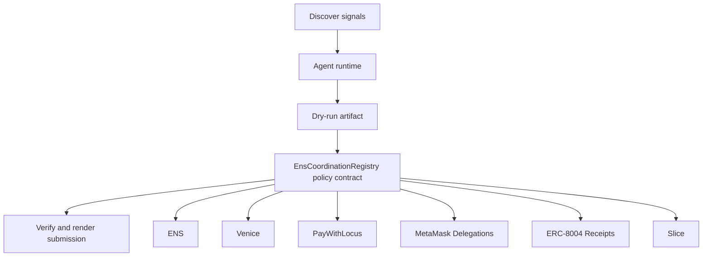

# NameMesh Control Plane

- **Repo:** `Synthesis-ENS`
- **Primary track:** ENS
- **Category:** identity
- **Submission status:** implementation ready, waiting for credentials and TxIDs.

An ENS-native control plane that lets agents coordinate, route payments, and emit human-readable receipts without falling back to raw addresses.

## Selected concept

Agents coordinate using ENS names, resolved permissions, and human-readable routing instead of raw addresses. The contract layer stores verified resolver commitments and communication receipts, while Python tooling renders name-based payment, messaging, and delegation plans.

## Idea shortlist

1. ENS-Only Agent Coordination
2. Human-Readable Treasury Routing
3. Private Messaging with Name Boundaries

## Partners covered

ENS, Venice, PayWithLocus, MetaMask Delegations, ERC-8004 Receipts, Slice

## Architecture



## Repository layout

- `src/`: shared policy contracts plus the repo-specific wrapper contract.
- `script/`: Foundry deployment entrypoint.
- `agents/`: Python runtime, partner adapters, and project metadata.
- `scripts/`: CLI utilities for running the loop and rendering submissions.
- `docs/`: architecture, credentials, demo script, and security notes.
- `submissions/`: generated `synthesis.md` snippet for this repo.

## Action catalog

| Action | Partner | Purpose | Max USD | Sensitivity |
| --- | --- | --- | --- | --- |
| `ens_ens_publish` | ENS | Use ENS for a bounded action in this repo. | $5 | low |
| `venice_private_analysis` | Venice | Use Venice for a bounded action in this repo. | $5 | high |
| `paywithlocus_subaccount_pay` | PayWithLocus | Use PayWithLocus for a bounded action in this repo. | $120 | medium |
| `metamask_delegations_delegate_scope` | MetaMask Delegations | Use MetaMask Delegations for a bounded action in this repo. | $2 | high |
| `erc_8004_receipts_receipt_anchor` | ERC-8004 Receipts | Use ERC-8004 Receipts for a bounded action in this repo. | $1 | medium |
| `slice_checkout_hook` | Slice | Use Slice for a bounded action in this repo. | $35 | medium |

## Commands

```bash
python3 -m unittest discover -s tests
forge test
python3 scripts/run_agent.py
python3 scripts/plan_live_demo.py
python3 scripts/render_submission.py
```

## Credentials

| Partner | Variables | Docs |
| --- | --- | --- |
| ENS | ENS_NAME | https://docs.ens.domains/ |
| Venice | VENICE_API_KEY, VENICE_CHAT_COMPLETIONS_URL, VENICE_MODEL | https://docs.venice.ai/ |
| PayWithLocus | LOCUS_API_KEY, LOCUS_PAYMENT_URL | https://docs.locus.finance/ |
| MetaMask Delegations | RPC_URL | https://docs.metamask.io/delegation-toolkit/ |
| ERC-8004 Receipts | RPC_URL | https://eips.ethereum.org/EIPS/eip-8004 |
| Slice | SLICE_API_KEY, SLICE_HOOK_URL | https://docs.slice.so/ |

## Live demo plan

1. Copy .env.example to .env and fill the required keys.
2. Deploy the contract with forge script script/Deploy.s.sol --broadcast for EnsCoordinationRegistry.
3. Run python3 scripts/run_agent.py to produce a dry run for ens_mesh.
4. Set LIVE_MODE=true and rerun python3 scripts/run_agent.py with real credentials.
5. Run python3 scripts/render_submission.py and attach TxIDs plus repo links.
